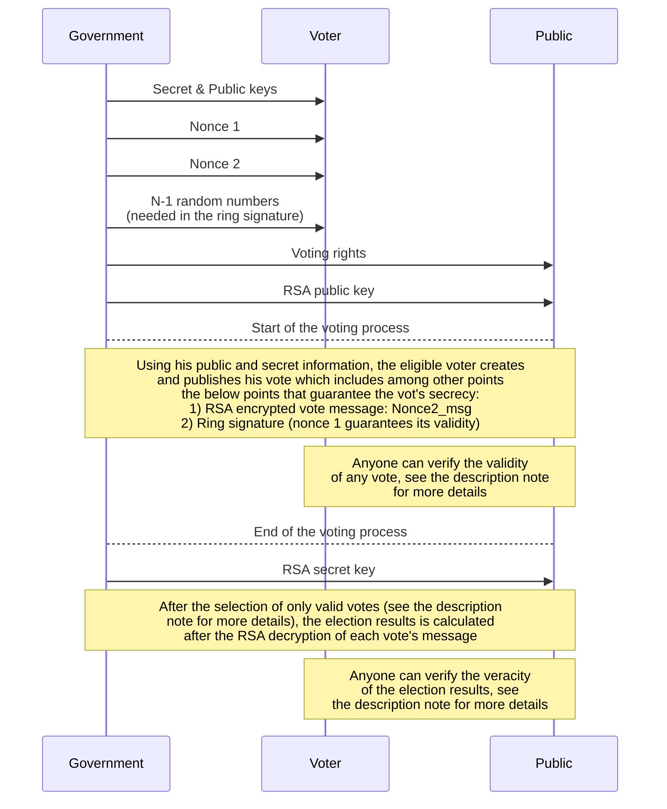

# Blockchain based election

This repo contains a [note](https://github.com/GAKht/BCelec/blob/master/BCelecReq.pdf) (./BCelecReq.pdf) and the implementation (./Code) of a blockchain designed for use in elections. The code structure is described below.

The blockchain was coded in Python 3.10.2. For any comments or questions, please contact me on guill.khayat@gmail.com.

### Who gets and does what?

The below diagram presents briefly the main points that guarantee the election's safety and transparency. See the description [note](https://github.com/GAKht/BCelec/blob/master/BCelecReq.pdf) for more details.

### Implementation

Unless specified differently, all files in ./Code are Python files (.py).

* Root:
  * impPackages.bat: installs the packages needed for the blockchain
  * globImp: imports all needed packages in the blockchain
  * globParams: sets the main parameters used in the blockchain
* Gvt: a folder where the central government's databases and codes are stored
  * Db: folder where databases which should be accessed to by only the central government are stored
  * a01genKeys: generates all secret information needed by eligible voters to create a vote
  * a02voteRights: creates voting rights used in the election process
  * a03RSAkeys: creates secret and public RSA keys used to ensure the secrecy of the vote message when a vote is created
  * a04genBckChain: creates the initial block in the blockchain (only non-child block)
  * a05verifElecResult: verifies the blockchain and calculate the election result
* Voter: a folder where all databases and codes of the voter V are stored
  * Db: folder where databases which should be accessed to by only the voter V are stored
  * vote: creates eligible votes of different voters
  * falseVotes: creates non-valid votes for testing purposes
* Verif: a folder where all public information and codes are stored
  * PubParams: folder where databases which stores public parameters are stored
  * VoteBckChain: folder where databases which stores votes and the blockchain are stored
  * verifVoteCrtBck: verifies votes and creates a block of valid votes
* Util: a folder where useful functions and classes are stored
  * Cls: a folder where useful classes are stored
  * Fcts: a folder where useful functions are stored
